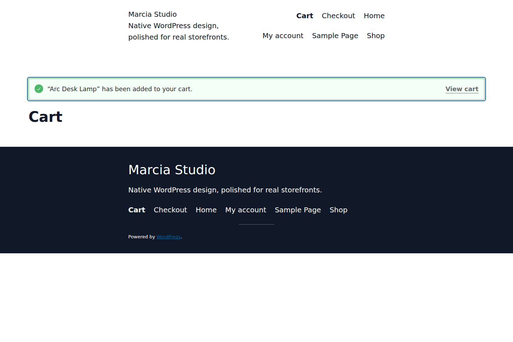
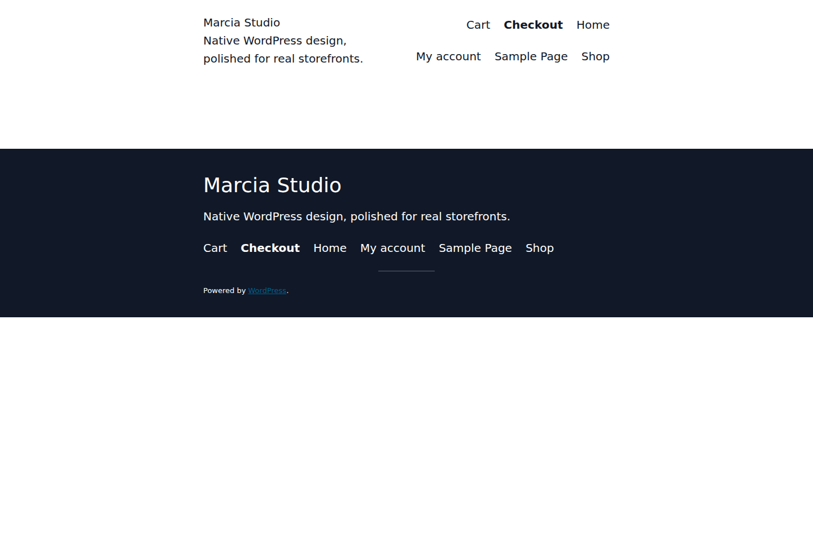

# Marcia

Marcia is a WordPress block theme maintained in the `agustealo/Krys` repository. The theme focuses on native WordPress site editing, a reusable design system, curated patterns, and presentation-level WooCommerce support without taking ownership of site/server/plugin policy.

## Runtime preview


These images are captured from a real temporary WordPress 7.1.1 + WooCommerce runtime, not a design mockup. The fixture uses the production theme files and real WooCommerce product/cart behavior while keeping demo data out of the shipped theme.

| WooCommerce shop | Cart in action |
| --- | --- |
|  |  |

| Checkout | Mobile viewport |
| --- | --- |
|  |  |

See [the runtime showcase](docs/SHOWCASE.md) for capture provenance and reproduction details.

## Requirements

- WordPress 6.8 or newer
- PHP 8.0 or newer
- Current CI smoke target: WordPress 7.1.1
- WooCommerce is optional

## Architecture contract

Marcia keeps authority deliberately narrow:

- WordPress core owns block-pattern discovery, templates, editor behavior, site content, embeds, revisions, caching policy and platform runtime.
- `theme.json` owns design tokens and editor-facing design controls.
- Theme PHP/CSS owns presentation setup and block styling.
- WooCommerce owns cart, checkout, sessions, commerce scripts and business behavior.
- CI owns claims that source, activation, integration and packaging have passed.

The theme does not disable XML-RPC, rewrite cache headers, change memory/autosave/revision policy, start output compression, remove global styles, or dequeue WooCommerce runtime assets.

## Development

```bash
php tools/validate-theme.php
php tools/build-release.php
```

`package.json` exposes the same commands as `npm test`, `npm run validate`, and `npm run zip`; Node dependencies are not required for the theme runtime or release build.

## Patterns

Patterns are discovered by WordPress from the nested `/patterns` directory. WordPress 6.8 is therefore the minimum supported core version. Patterns that depended on missing local media, remote placeholder media, or fake form/newsletter behavior were removed from the release set rather than replaced with dummy assets.

## WooCommerce

WooCommerce product templates live directly in `/templates`. `page-cart.html` and `page-checkout.html` render the assigned WooCommerce page content through `woocommerce/page-content-wrapper` and `core/post-content`, so the editor and shopper experience share the same cart/checkout authority.

## Release evidence

The `Theme CI` workflow gates pull requests with:

- PHP 8.0 and 8.4 source validation and syntax checks
- WordPress 7.1.1 activation and clean-boot smoke proof
- native Marcia pattern registration proof
- live WooCommerce install/activation and theme-support proof
- validated release ZIP construction

A WordPress.org screenshot, visual browser review, keyboard/screen-reader review, and real storefront transaction testing remain explicit manual release gates.

## License

GNU General Public License v2 or later.
