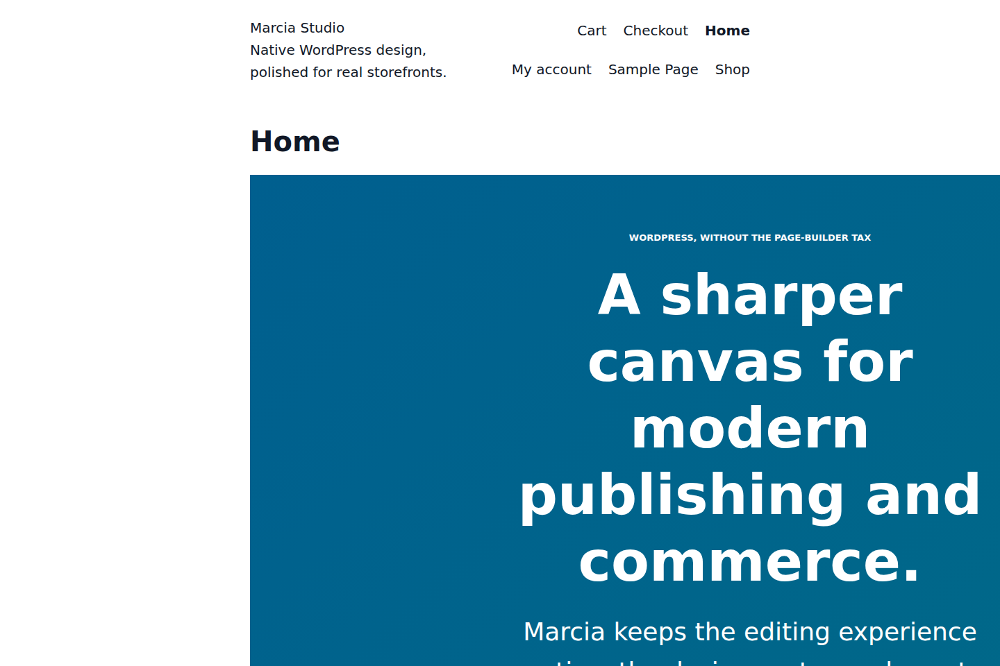
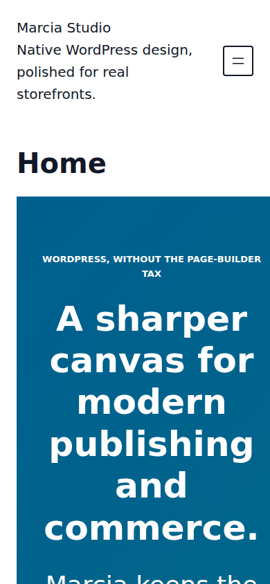

# Marcia runtime showcase

These screenshots are generated from a real temporary WordPress 7.1.1 + WooCommerce installation running the current Marcia branch. The fixture creates normal WordPress pages, real WooCommerce products, local generated product media, and an actual browser add-to-cart action. It does not inject screenshot-only CSS into Marcia or ship demo data with the theme.

## Homepage

The homepage demonstrates the production `theme.json` palette, typography, spacing, button styles, cards, header, navigation, and footer on ordinary WordPress block content. A fixture-only Site Editor template removes the generic page-title wrapper so the screenshot reflects a normal purpose-built homepage rather than a documentation artifact.

## Shop in action

The shop screenshot is the real WooCommerce product archive rendered through `templates/archive-product.html`. Product data and product media are generated only inside the documentation fixture.

## Product page

The product view is rendered through Marcia's production `templates/single-product.html` and WooCommerce's real product blocks and product data.

## Add to cart in action

The browser opens the real product page, clicks the WooCommerce **Add to cart** button, waits for WooCommerce's success notice, and only then captures this image. The screenshot is therefore evidence of the live interaction rather than a staged success message.

## Mobile viewport

The mobile screenshot is captured at a 390 × 844 viewport from the same WordPress runtime.

## Reproducing the screenshots

The branch-specific workflow `.github/workflows/capture-doc-screenshots.yml` installs WordPress and WooCommerce, loads `tools/setup-screenshot-demo.php`, launches the site, captures the screens with Chromium through `tools/capture-doc-screenshots.mjs`, uploads the images as a workflow artifact, and commits changed PNGs back to the documentation branch.

These documentation images are not a substitute for the separate WordPress.org `screenshot.png` release asset or for manual accessibility/browser review.
