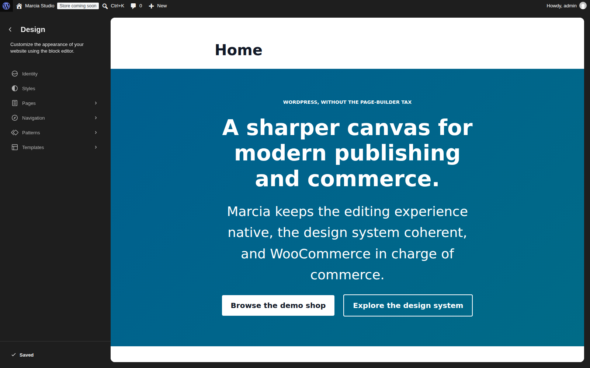
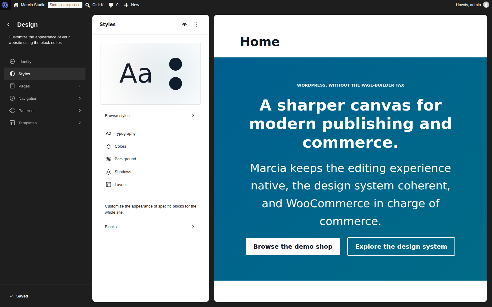
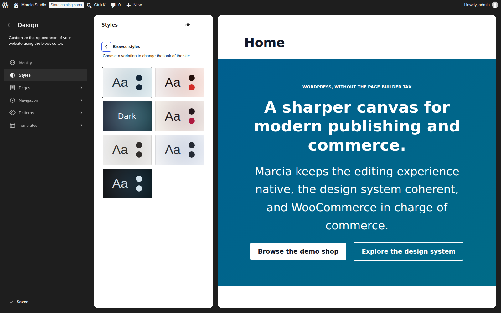
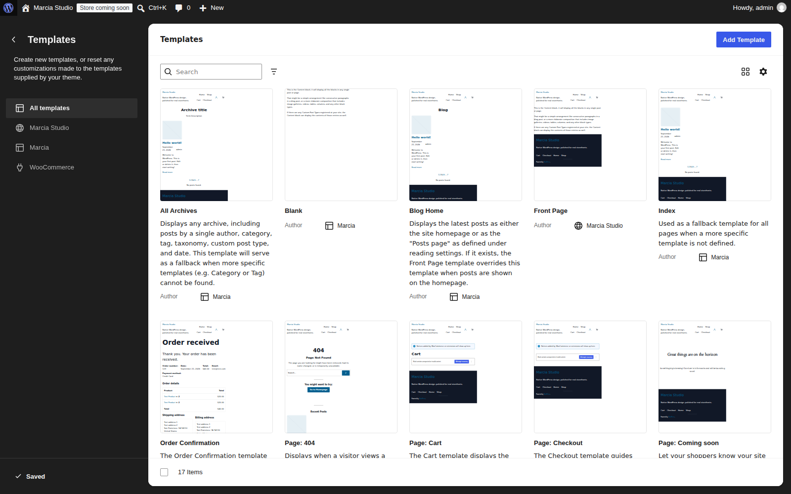
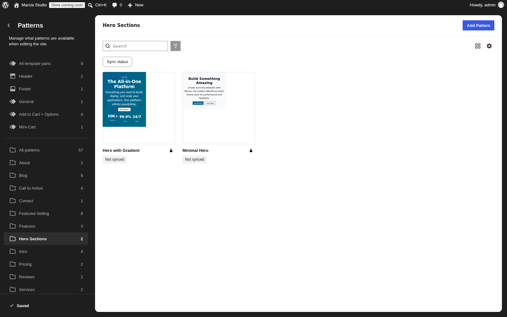
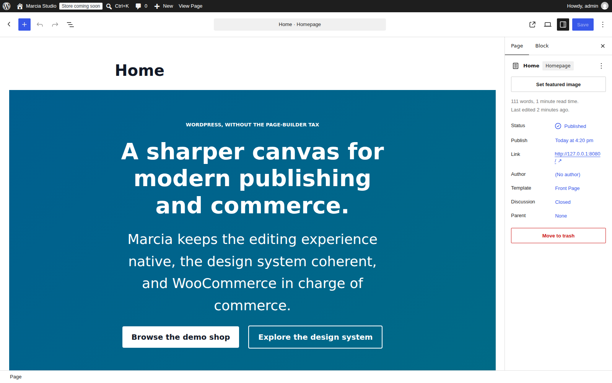

# Marcia runtime showcase

These screenshots are generated from a real temporary WordPress 7.1.1 + WooCommerce installation running the current Marcia branch. The fixture creates normal WordPress pages, real WooCommerce products, local generated product media, and an actual browser add-to-cart action. It also signs into the real WordPress administration area to capture the Site Editor and block editor. It does not inject screenshot-only CSS into Marcia or ship demo data with the theme.

## Homepage

The homepage demonstrates the production `theme.json` palette, typography, spacing, button styles, cards, header, navigation, and footer on ordinary WordPress block content. A fixture-only Site Editor template removes the generic page-title wrapper so the screenshot reflects a normal purpose-built homepage rather than a documentation artifact.

## Shop in action

The shop screenshot is the real WooCommerce product archive rendered through `templates/archive-product.html`. Product data and product media are generated only inside the documentation fixture.

## Product page

The product view is rendered through Marcia's production `templates/single-product.html` and WooCommerce's real product blocks and product data.

## Add to cart in action

The browser opens the real product page, clicks the WooCommerce **Add to cart** button, waits for WooCommerce's success notice, and only then captures this image. The screenshot is therefore evidence of the live interaction rather than a staged success message.

## Mobile viewport

The mobile screenshot is captured at a 390 × 844 viewport from the same WordPress runtime.

# Native WordPress administration and editing

Marcia intentionally uses WordPress's own Site Editor and block editor rather than maintaining a second theme-specific administration system. These captures show the editing surfaces a site owner actually uses.

## Site Editor overview

This is the authenticated WordPress Site Editor with the Marcia site rendered beside the native design navigation. Identity, Styles, Pages, Navigation, Patterns, and Templates remain WordPress-owned editing surfaces.

## Global Styles

The Global Styles panel exposes the design controls supplied through Marcia's production `theme.json`, including typography, colors, background, shadows, layout, and block-level styling.

## Bundled style variations

The **Browse styles** view shows the six bundled Marcia style variations using WordPress's native style-variation workflow. No separate theme options screen is required.

## Template library

The Templates view demonstrates the real template inventory available to editors, including Marcia templates and WooCommerce-provided commerce templates. It is useful evidence that store presentation participates in the same block-theme editing model rather than a parallel template UI.

## Theme patterns

The Patterns capture is deliberately scoped to Marcia's **Hero Sections** category instead of showing WordPress and WooCommerce's entire combined pattern library. This makes the screenshot evidence about the theme itself rather than about installed software in general.

## Page editor

The Home page is opened in the authenticated block editor with Marcia's actual block content and page settings visible. The capture workflow dismisses WordPress's first-run editor guide before taking the screenshot so the editing canvas is not obscured.

## Visual QA found a real theme issue

The first authenticated capture pass exposed a contrast problem in Marcia's custom outline/ghost button styles: they forced the primary brand color even when placed on a primary-colored background. The theme stylesheet was corrected so those variations inherit the surrounding text color and remain composable on light and dark/theme-colored surfaces. The documentation images therefore record the corrected runtime rather than hiding the defect with screenshot-only styling.

## Reproducing the screenshots

The branch workflow `.github/workflows/capture-doc-screenshots.yml` installs WordPress and WooCommerce, loads `tools/setup-screenshot-demo.php`, launches the site, captures the public and authenticated screens with Chromium through `tools/capture-doc-screenshots.mjs`, uploads the PNGs as a workflow artifact, and commits changed images back to the documentation branch.

All fixture content, credentials, generated product media, and browser tooling are documentation/test infrastructure only. They are excluded from the consumer release ZIP by the release builder.

These documentation images are not a substitute for the separate WordPress.org `screenshot.png` release asset or for manual accessibility/browser review.
