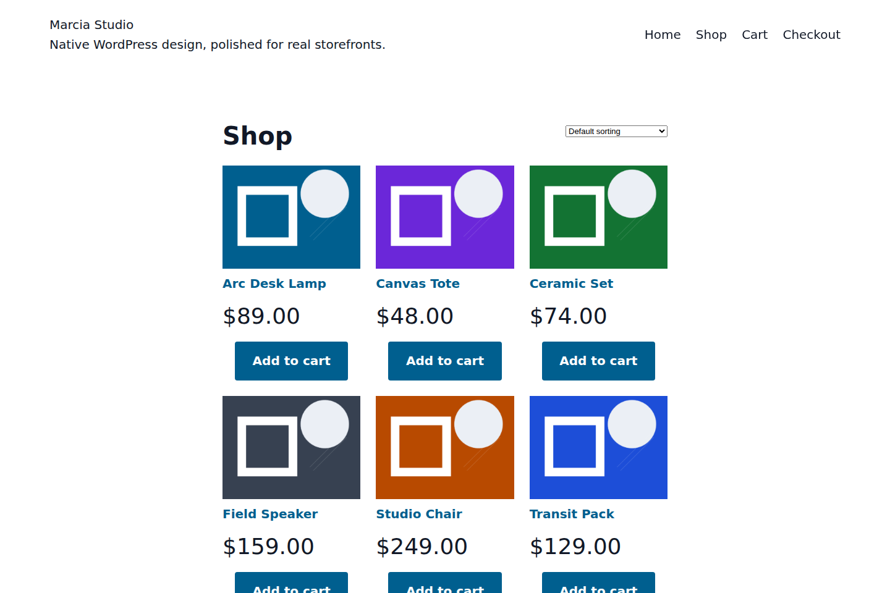
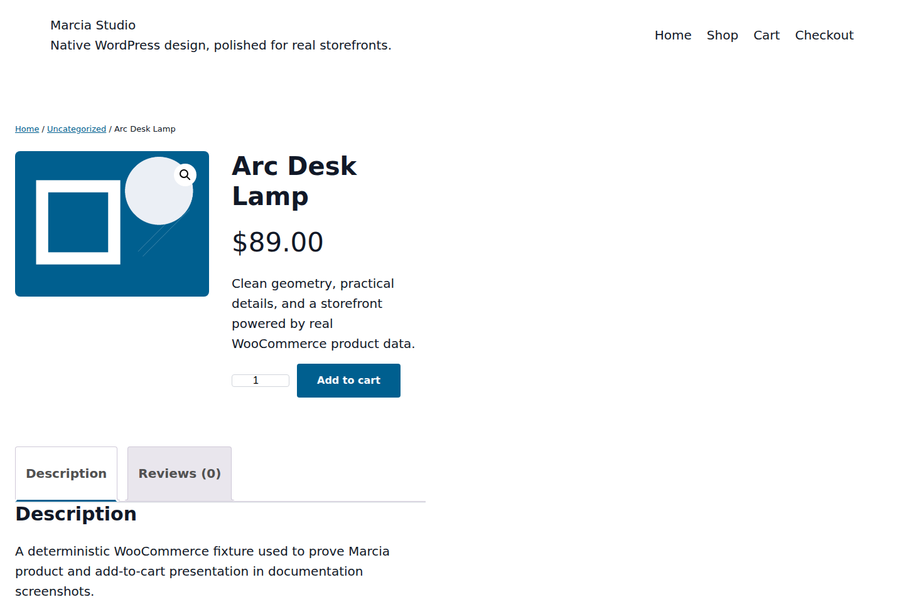
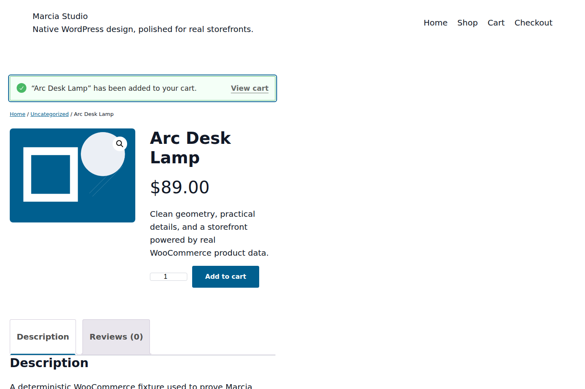

# WooCommerce integration

Marcia treats WooCommerce as the authority for commerce behavior. The theme provides presentation support, product templates, and additive styling without replacing cart sessions, checkout logic, scripts, wrappers, business policy, or merchant configuration.

## Runtime views

### Product archive

### Product page

### Add to cart

The documentation capture fixture creates real WooCommerce products and then uses a real Chromium browser session to click the product's Add to cart button. None of that fixture data ships with the theme. See [the runtime showcase](SHOWCASE.md) for provenance and reproduction details.

## Requirements

- WordPress 6.8 or newer
- PHP 8.0 or newer
- A currently supported WooCommerce release

The pull-request smoke gate installs the current WooCommerce plugin on WordPress 7.1.1 and verifies that the plugin loads and Marcia declares WooCommerce theme support.

## Template ownership

WooCommerce block-theme overrides live directly in `/templates`:

- `archive-product.html`
- `single-product.html`
- `page-cart.html`
- `page-checkout.html`

Cart and Checkout are special. Their functional Cart/Checkout blocks belong in the assigned WordPress page content, not hard-coded into the theme template. Marcia therefore wraps `core/post-content` with `woocommerce/page-content-wrapper` so the Site Editor, page editor, and storefront share the same source of truth.

Do not move these templates into `templates/woocommerce/` and do not replace `core/post-content` with a hard-coded `woocommerce/cart` or `woocommerce/checkout` block.

## Theme integration code

`inc/woocommerce.php` is presentation-only. It:

- declares WooCommerce theme support and gallery support;
- defines presentation image/grid preferences;
- loads Marcia's WooCommerce stylesheet additively.

It must not:

- dequeue WooCommerce styles or scripts;
- disable cart fragments or other Woo runtime behavior;
- inject cart UI through classic `wp_nav_menu_items` hooks;
- create unauthenticated theme-owned AJAX cart endpoints;
- replace WooCommerce content wrappers as a parallel template system;
- impose shipping, returns, payment, tax, coupon, support, or security claims for the merchant.

## Product templates

### Product archive

`templates/archive-product.html` provides the product catalog presentation using WooCommerce blocks and the inherited catalog query. Merchant data, filtering behavior, sorting behavior, inventory, price, and add-to-cart behavior remain WooCommerce-owned.

### Single product

`templates/single-product.html` presents WooCommerce's product gallery, title, rating, price, excerpt, add-to-cart form, metadata, product details, and related products. It intentionally avoids theme-authored promises such as free shipping, return windows, payment guarantees, or support availability.

## Patterns

Only patterns that can ship without missing local assets, remote placeholder media, or fake commerce/form behavior belong in the release set. A pattern may arrange real WooCommerce blocks, but it must not simulate a newsletter signup, payment flow, discount engine, inventory state, or other business function the theme does not implement.

## Customization

Use Appearance > Editor for colors, typography, spacing, templates, and style variations. Prefer `theme.json` and WooCommerce-supported global styles over CSS selectors that depend on private internal markup.

## Verification

Automated pull-request gates prove:

1. Marcia activates as a block theme on WordPress 7.1.1.
2. WooCommerce installs and activates.
3. `current_theme_supports( 'woocommerce' )` is true.
4. Cart and Checkout template structure passes source validation.
5. The release ZIP is built only after those gates pass.

The documentation capture additionally proves that the current product archive and single-product presentation render in a real browser and that a real WooCommerce Add to cart action completes visibly.

Before a public release, also run a real test product through product page, add-to-cart, cart, checkout, account, and order flows with a test payment gateway. Record the exact WordPress, WooCommerce, Marcia, PHP, browser, and candidate commit versions used.
